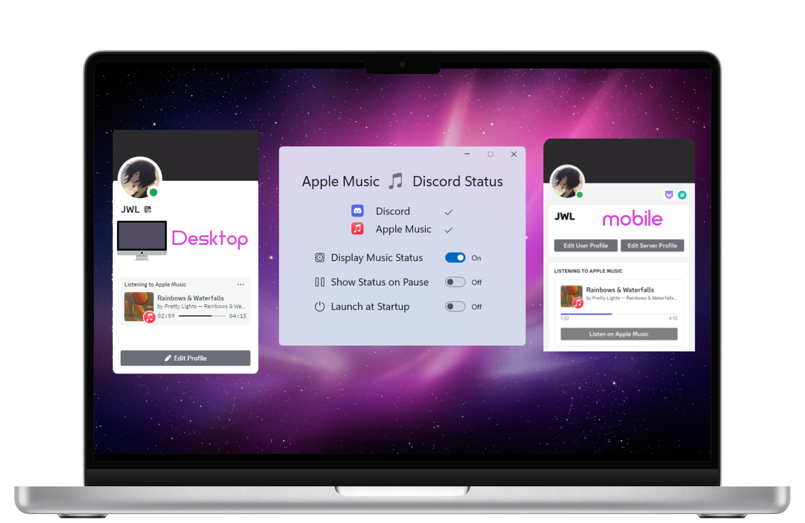

<h2 align="center">
    Apple Music - Discord Status 
</h2>

    

 

## Features
- Display Apple Music as Discord Status
- Toggle Discord Music Status
- Toggle Show Status on Pause
- Toggle Launch at Startup

## Supports
- Windows 10+

## How it Works
- Apple Music is scraped using [UI Automation](https://learn.microsoft.com/en-us/windows/win32/winauto/entry-uiauto-win32)
- Song info is scraped from the Desktop Player
- Album artwork and song link are obtained via iTunes API

## Built With
- [WinUI3](https://github.com/microsoft/microsoft-ui-xaml)
- [Discord Rich Presence](https://github.com/Lachee/discord-rpc-csharp)

## License
This project is released under the GNU GPL License - see the [LICENSE](LICENSE) file for details
